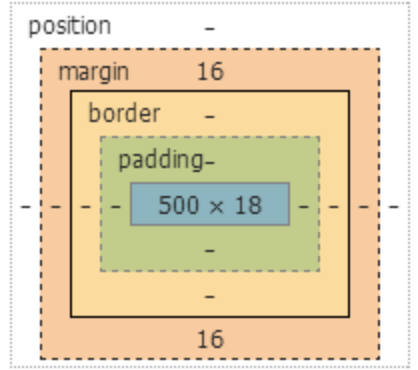
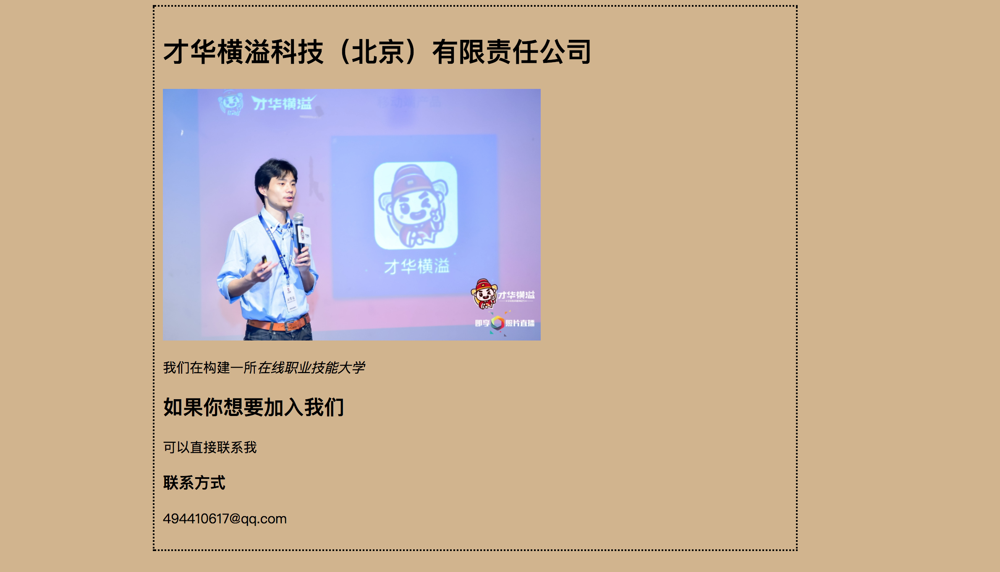

# html/css 操作教程

第一部分：基础篇

1、新建一个专案

```rails new htmlcss```

2、新建一个 welcome 的 controller

```rails g controller welcome index```

3、修改config/rontes.rb

```将get welcome / index 修改为 root ：welcome#index```

4、让专案跑起来

```rails s```

5、可以看到在http://localhost:3000/页面出现

Welcome#index
Find me in app/views/welcome/index.html.erb

6、开始学习修改 welcome 的静态界面

(1)删除 welcome 的代码

<del>Welcome#index
Find me in app/views/welcome/index.html.erb
<del>

(2)添加下面的代码的内容

```<html>
   <head>
      <title>我是肖威</title>
  </head>
  <body>
      <h1>才华横溢科技（北京）有限责任公司</h1>
      
      <p>我们在构建一所<em>在线职业技能大学</em></p>
      <h2>如果你想要加入我们</h2>
      <p>可以直接联系我</p>
      <h3>联系方式</h3>
      <p>494410617@qq.com</p>
   </body>
 <html>
 ```

 7、修改app/views/layouts/application.html.erb里面的标题；
  ```
  <title>Htmlcss</title>
  改变为
  <title>才华横溢</title>
   ```
   page的首页可以变为从Htmlcss变为才华横溢


8、添加style标签,修改图片大小



```
<html>
   <head>
      <title>我是肖威</title>
      <style type="text/css">
         body{
           background-color: #d2b48c;（添加土黄色背景）
           margin-left: 20%;（设置左右外边距占页面20%）
           margin-right: 20%;
           border: 2px dotted black;（定义页面主题周围的边框是虚线，颜色是黑色）
           padding: 10px 10px 10px 10px;（在页面主题周围创建一些内边距）
           font-family: sans-serif;（定义文本使用字体）
         }
      </style>
  </head>
  <body>
      <h1>才华横溢科技（北京）有限责任公司</h1>
      
      <p>我们在构建一所<em>在线职业技能大学</em></p>
      <h2>如果你想要加入我们</h2>
      <p>可以直接联系我</p>
      <h3>联系方式</h3>
      <p>494410617@qq.com</p>
   </body>
 <html>

 ```

9、增加一个超链接

 ```
 <html>
    <head>
       <title>我是肖威</title>
       <style type="text/css">
          body{
            background-color: #d2b48c;（添加土黄色背景）
            margin-left: 20%;（设置左右外边距占页面20%）
            margin-right: 20%;
            border: 2px dotted black;（定义页面主题周围的边框是虚线，颜色是黑色）
            padding: 10px 10px 10px 10px;（在页面主题周围创建一些内边距）
            font-family: sans-serif;（定义文本使用字体）
          }
       </style>
   </head>
   <body>
       <h1>才华横溢科技（北京）有限责任公司</h1>
       
       <p>我们在构建一所<em>在线职业技能大学</em></p>
       <h2>如果你想要加入我们</h2>
       <p>可以直接联系我</p>
       <h3>联系方式</h3>
       <p>494410617@qq.com</p>
       <h3>官方网址</h3>
       <a href="http://www.caihuahengyi.cn">www.caihuahengyi.cn</a>
    </body>
  <html>

  ```

10、呈现效果
  


第二部分：blog界面制作
