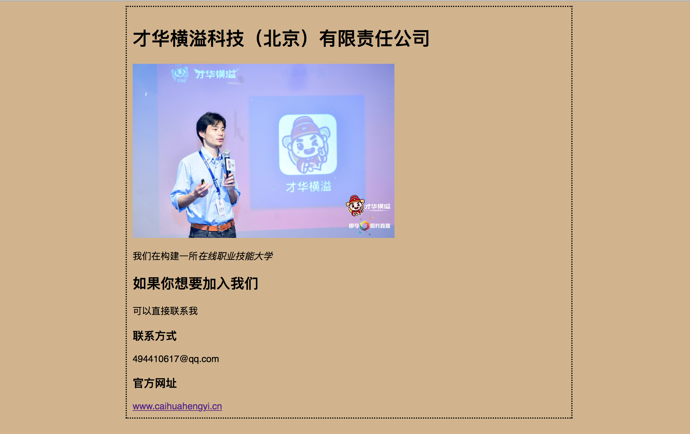

# html/css 操作教程


# 参考书籍：
## Head First Html 与 CSS 第2版
## 精通HTML5+CSS3+JavaScript网页设计

---
  
# 第一部分：基础篇

1、新建一个专案

```rails new htmlcss```

2、新建一个 welcome 的 controller

```rails g controller welcome index```

3、修改config/rontes.rb

```将get welcome / index 修改为 root ：welcome#index```

4、让专案跑起来

```rails s```

5、可以看到在http://localhost:3000/页面出现

Welcome#index
Find me in app/views/welcome/index.html.erb

6、开始学习修改 welcome 的静态界面

(1)删除 welcome 的代码

<del>Welcome#index
Find me in app/views/welcome/index.html.erb
<del>

(2)添加下面的代码的内容

```<html>
   <head>
      <title>我是肖威</title>
  </head>
  <body>
      <h1>才华横溢科技（北京）有限责任公司</h1>
      
      <p>我们在构建一所<em>在线职业技能大学</em></p>
      <h2>如果你想要加入我们</h2>
      <p>可以直接联系我</p>
      <h3>联系方式</h3>
      <p>494410617@qq.com</p>
   </body>
 <html>
 ```

 7、修改app/views/layouts/application.html.erb里面的标题；
  ```
  <title>Htmlcss</title>
  改变为
  <title>才华横溢</title>
   ```
   page的首页可以变为从Htmlcss变为才华横溢


8、添加style标签,修改图片大小


```
<html>
   <head>
      <title>我是肖威</title>
      <style type="text/css">
         body{
           background-color: #d2b48c;（添加土黄色背景）
           margin-left: 20%;（设置左右外边距占页面20%）
           margin-right: 20%;
           border: 2px dotted black;（定义页面主题周围的边框是虚线，颜色是黑色）
           padding: 10px 10px 10px 10px;（在页面主题周围创建一些内边距）
           font-family: sans-serif;（定义文本使用字体）
         }
      </style>
  </head>
  <body>
      <h1>才华横溢科技（北京）有限责任公司</h1>
      
      <p>我们在构建一所<em>在线职业技能大学</em></p>
      <h2>如果你想要加入我们</h2>
      <p>可以直接联系我</p>
      <h3>联系方式</h3>
      <p>494410617@qq.com</p>
   </body>
 <html>

 ```

9、增加一个超链接

 ```
 <html>
    <head>
       <title>我是肖威</title>
       <style type="text/css">
          body{
            background-color: #d2b48c;
            margin-left: 20%;
            margin-right: 20%;
            border: 2px dotted black;
            padding: 10px 10px 10px 10px;
            font-family: sans-serif;
          }
       </style>
   </head>
   <body>
       <h1>才华横溢科技（北京）有限责任公司</h1>
       
       <p>我们在构建一所<em>在线职业技能大学</em></p>
       <h2>如果你想要加入我们</h2>
       <p>可以直接联系我</p>
       <h3>联系方式</h3>
       <p>494410617@qq.com</p>
       <h3>官方网址</h3>
       <a href="http://www.caihuahengyi.cn">www.caihuahengyi.cn</a>
    </body>
  <html>

  ```

10、呈现效果
  

11、定义不同的标签
```<html>
   <head>
      <title>我是肖威</title>
      <style type="text/css">
      body{
        background-color: #d2b48c;
        margin-left: 20%;
        margin-right: 20%;
        border: 2px dotted black;
        padding: 10px 10px 10px 10px;
        font-family: sans-serif;
      }


      h1,h2{
        font-family: sans-serif;
        color: gray;
      }

      h1{
        border-bottom: 1px solid black;
      }

      p{
        color: maroon;
      }

      p.green{
        color: green
      }


      </style>
  </head>

<body>
      <h1>才华横溢科技（北京）有限责任公司</h1>
      
      <p>我们在构建一所<em>在线职业技能大学</em></p>
      <h2>如果你想要加入我们</h2>
      <p>可以直接联系我</p>
      <h3>联系方式</h3>
      <p class='green'>494410617@qq.com</p>
      <h3>官方网址</h3>
      <a href="http://www.caihuahengyi.cn">www.caihuahengyi.cn</a>
</body>
 <html>
```
 11、呈现效果
   


# 第二部分：网页静态页面制作

一、修改代码：

```
清空 welcome 的全部的数据
使用下面的代码数据完成替换
```

```
<!DOCTYPE html>
<html>
  <head>
    <meta charset="utf-8">
    <title></title>

       <style type="text/css">
       body{
         background-color: #b5a789;
         margin:0px;
       }
       #herder{
         background-color: #675c47;
         margin:10px;
         height:140px;
         text-align: center;
       }

       #main{
         display: table-cell;
         background: #675c46;
         padding: 15px;
         font-size: 105%;
         margin: 0px 330px 10px 10px;
         width: 420px;
         float: left;

       }

       #sidebar{
         display: table-cell;
         background: #675c43;
         font-size: 105%;
         padding: 15px;
         margin: 0px 10px 10px 10px;
         /*position: absolute;*/
        /* top:150px;*/
         /* right:0px;*/
         /* width:280px;*/

       }

       #footer{
         background-color: #675c47;
         color: #efe5d0;
         text-align: center;
         padding: 15px;
         margin: 10px;
         font-size:90%;
         clear: left;
       }

       h1{
          font-size:120%;
          color: #954b4b;
       }

       #slogan{
         color: #954b4b;

       }

       #tableContainer{
       display: table;
       }

       #tableRow{
       display: table-row;
       }
       </style>

   </head>

      <body>
        <div id="herder">
        <h1>欢迎来到才华横溢的在线职业技能大学</h1>
        <p>这里，将帮助你获取成功</p>
        <a href="http：www.caihuahengyi.cn">www.caihuahengyi.cn</a>
        </div>


<div id="tableContainer">
  <div id="tableRow">
        <div id="main">
        <h1>立即学习</h1>
        
        <p>加快速度</p>
        </div>

        <div id="sidebar">
           <p class=green>
          <br>

          <a href="http:www.caihuahengyi.cn">www.caihuahengyi.cn</a>
          <br>
          <span class=slogan>
           更高<br>
           更快<br>
           更强<br>
          </span>
           </p>
        </div>

      </div>
</div>


        <div id="footer">

          &copy; 2018;caihuahengyi
          <br>
          帮助普通人获得成功的一所在线职业技能大学

        </div>
  </body>
</html>

```

二、呈现效果
  

# 第三部分：静态网页全部呈现

一、清空 welcome 专案
```
清空 welcome 的全部的数据
使用下面的代码数据完成替换
```

```


<html>
   <head>
      <title>我是肖威</title>
      <style type="text/css">
         body{
           background-color: #b5a789;
           font-family: sans-serif;
           font-size: small;
           margin: 0px;
         }

         header{
           background-color: #675c47;
           margin: 10px 10px 10px 10px ;
           height:150px;
           text-align: center;
           border: 2px dotted black;
         }

         aside {
           display:table-cell;
           background: #675c47;
           font-size:90%;
           padding: 15px;
           vertical-align: top;
           margin: 10px 10px 10px 10px ;
           text-align: center;
           border: 2px dotted black;
         }

        footer{
          background-color: #675c47;
          color: #efe5d0;
          text-align: center;
          padding: 15px;
          margin: 10px  10px 10px 10px;
          font-size: 90%;
          border: 2px dotted black;
        }

        section#sidebar{
          display: table-cell;
          background: #675c47;
          width:20%;
          padding: 15px;
          vertical-align: top;
          margin: 10px 10px 10px 10px ;
          text-align: center;
          border: 2px dotted black;
        }

        section#main{
          display: table-cell;
          background: #675c47;;
          font-size: :90%
          padding:15px 15px 15px 15px;
          vertical-align: top;
          margin: 10px 10px 10px 10px ;
          text-align: center;
          border: 2px dotted black;
      }

        h1{
          color:white;
        }

        p{
          color:white;
        }


      nav{
        background-color: #efe5d0;
        margin: 10px 10px 10px 10px;

      }

      nav ul {
        margin:0px;
        list-style-type: none;


      }

      nav ul li {
        display: inline;
        padding: 10px 10px 10px 10px;
      }

      nav ul.li.selected{
        background-color: #c8b99c;
      }
      </style>


  </head>
  <body>


    <nav>
  <ul>
    <li>才华横溢</li>
    <li>学习大厅</li>
    <li>帮助中心</li>
    <li>立即报名</li>
  </ul>
    </nav>

    <header class='top'>
    <h1>欢迎来到才华横溢的在线职业技能大学</h1>
    <p>在这里，将帮助你获取成功</p>
    </header>

<div id="tableContainer">
      <div id="tableRow">
            <section id="sidebar">
              
              <p>这里，将帮助你获取成功</p>
              <audio controls="controls">
            <source src="http://audio.xmcdn.com/group39/M08/D6/47/wKgJn1pqTSKyTdTEAB06n_38gao036.m4a" type="audio/mp3" />
          </audio>
              </section>
                 <section id="main">
                     <iframe height=288 width=512 src='http://player.youku.com/embed/XMzI5NDI2MjYyNA==' frameborder=0 'allowfullscreen'></iframe>
                     
                     <p>在这里，将帮助你获取成功</p>

              </section>
                 <aside>
                   

                  <p>在这里，将帮助你获取成功</p>
                  <audio controls="controls">
                  <source src="http://audio.xmcdn.com/group39/M08/D6/47/wKgJn1pqTSKyTdTEAB06n_38gao036.m4a" type="audio/mp3" />
                  </audio>


               </audio>
                </aside>
          </div>
      </div>
</div>

</div>

    <footer>
    &copy; 2018;caihuahengyi
    <br>
    帮助普通人获得成功的一所在线职业技能大学
    <br>
    <time datetime="2018-01-26">2018/01/26</time>
    </footer>


   </body>
 <html>
```

二、呈现效果
  

# 第四部分：静态页面呈现


```
清空 welcome 的全部的数据
使用下面的代码数据完成替换
```

(1)页面结构

```
<!DOCTYPE html>
<html>
  <head>
    <meta charset="utf-8">
    <title>才华横溢</title>
    <style type="text/css">

       </style>
  </head>
  <body>
        <div id="container">

            <div id="header">
                  <h1>欢迎来到才华横溢职业技能在线大学</h1>
                  <p class="white">帮助普通人获得成功的大学</p>
            </div>

            <div id="menu">
                    <li><a href="http://caihuahengyi.cn">懂你时间</li></a>
                    <li><a href="http://caihuahengyi.cn">学习大厅</li></a>
                    <li><a href="http://caihuahengyi.cn">帮助中心</li></a>
                    <li><a href="http://caihuahengyi.cn">立即报名</li></a>
           </div>

            <div id="content">

                  <h3><a href="http://caihuahengyi.cn">欢迎来到全球最大的职业技能大学</a></h3>
                  <p>
                    <audio controls="controls">
                      <source src="http://audio.xmcdn.com/group39/M08/D6/47/wKgJn1pqTSKyTdTEAB06n_38gao036.m4a" type="audio/mp3" />
                    </audio>
                  </p>

            </div>

            <div id="classroom">
            <h3><span>主推课程</span></h3>
            <ul class="">
              <li><a href="#">全栈工程师</a></li>
              <li><a href="#">职场化办公</a></li>
              <li><a href="#">内容运营官</a></li>
            </ul>
            <h3><span>前沿科技</span></h3>
            <ul class="">
              <li><a href="#">区块链技术</a></li>
              <li><a href="#">虚拟现实技术</a></li>
              <li><a href="#">人工智能技术</a></li>
            </ul>
            <h3><span>管理课程</span></h3>
            <ul class="">
              <li><a href="#">财务官</a></li>
              <li><a href="#">执行官</a></li>
              <li><a href="#">运营官</a></li>
            </ul>
            </div>

            <div id="footer">
            <h3>才华横溢科技（北京）有限责任公司</h3>
            <p><a href="http://caihuahengyi.cn">帮助普通人获得成功的一所在线职业技能大学</a></p>
            <p>2014-2018</p>
            </div>
        </div>
  </body>
</html>
```
（2）、呈现效果
  

(3)将css 代码 放入 styesheets/application.css 里面（一个个的放入）
```
#container{
  margin: 0pt auto;
  width: 770px;
  position:relative;
  border: 2px dotted black;
}

#header{
  background: #c8b99c;
  text-align: center;
  border: 2px dotted black;
  margin: 0pt auto;
}
h1{
  margin: 0px;
  padding: 0px;
  border: 2px dotted black;
  text-align: center;
}
p.white{
  color:white;
  border: 2px dotted black;
  text-align: center;
}


#menu{
  position: absolute;
  top: 145px;
  border: 2px dotted black;
  width: 770px;
}

#menu li{
  list-style-type: none;
  float: left;
  text-align: center;
  width: 180px;
  margin-right: 3px;
  font-size: 1.05em;
  border: 2px dotted black;
}
#menu a:hover{
  color: rgb(149, 32, 32);
}

#content{
  background: #c8b99c;
  border: 2px dotted red;
  margin-top:130px;
  float: left;
  width: 450px;
  margin-left: 3px;
  height: 450px;

}

#content h3{
 text-align: center;
}

#content p{
  text-align: center;
}


#classroom{
  background: #c8b99c;
  border: 2px dotted red;
  float: right;
  width: 300px;
  margin-top:130px;
  margin-right: 3px;
  height: 450px;

}
#classroom li{
 list-style-type: none;

}

#classroom h3 {
 margin-left:20px;
}
#footer{
  background: #c8b99c;
  text-align: center;
  margin-top:650px;
}

#footer p {text-align: center;}
#footer h3 {text-align: center;}
#footer a {color: rgb(0, 0, 0);}
#footer a:hover{color: rgb(223, 58, 0);}
```

（4）、呈现效果
  

# 第五部分：增加动态数据交互

一、代码逻辑思维

增加MVC，修改root
增加M:rails g model message title:string description:text
rake db:migrate
增加C:rails g contrller messages
rails s
```
class MessagesController < ApplicationController
    before_action :find_message, only: [:show, :edit, :update, :destroy]

    def index
      @messages = Message.all.order("created_at DESC")
    end

     def show
     end

    def new
      @message = Message.new
    end

    def create
        @message = Message.new(message_params)
        if @message.save
          redirect_to messages_path
        else
          render 'new'
      end
    end

    def edit
    end

    def update
      if @message.update(message_params)
        redirect_to message_path
      else
        render 'edit'
      end
    end

    def destroy
      @message.destroy
      redirect_to messages_path
    end


    private
     def message_params
       params.require(:message).permit(:title,:description)
     end

     def find_message
       @message = Message.find(params[:id])
     end

  end

```
安装 simple_form 和bootstap

https://rubygems.org/gems/simple_form

https://rubygems.org/gems/bootstrap-sass

增加v:五个基础界面
- form.html.erb,
```
<%= simple_form_for @message do |f| %>
    <br>
    课程标题
    <%= f.text_field :title %>
    <br>
    课程大纲
    <%= f.text_area :description %>
    <br>
  <%= f.submit "增加" %>
<% end %>

```
- index.html.erb,
```
<% @messages.each do |message| %>
<h1><%= message.title %></h1>
<p><%= message.description %></p>
<%= link_to "阅览课程", message_path(message),class: "btn btn-success" %><h1>
</div>
<% end %>

<h2><%= link_to "新增课程", new_message_path, class: "btn btn-default pull-right" %></h2>

```
- show.html.erb,
```
<div class="col-md-8">
  <div class=message>
<h1><%= @message.title %></h1>
<p><%= @message.description %></p>
<!-- add a postde at timestamp !-->
<%= link_to "返回主页", root_path, class: "btn btn-default" %>
<%= link_to "编辑课程", edit_message_path(@message) %>
<%= link_to "删除课程", message_path(@message), method: :delete, data: { confirm: "Are you sure?" }, class: "btn btn-default" %>

</div>
</div>

```
- new.html.erb,
```
<div class="col-md-8">
  <h1>新建课程</h1>

<h1><%= render 'form' %><h1>

</div>


```
- edit.html.erb
```
<div class="col-md-4">
  <h1>编辑课程</h1>

<h1><%= render 'form' %></h1>
</div>
```

增加root：

```
resources :messages
```

增加首页按钮
```
 <p class="white">  <%= link_to "进入学习大厅", messages_path, class: "btn btn-default" %></p>
```
二、界面展示


